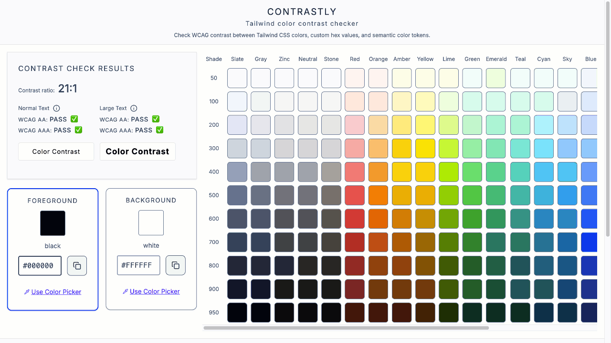
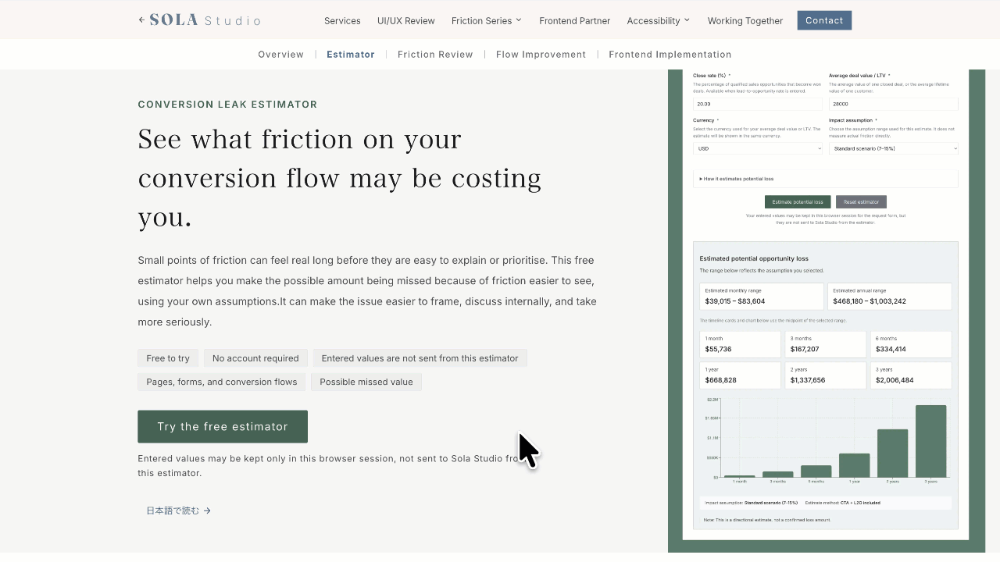

# Sola Studio

**UX Review · Dev-Ready Specs · Frontend Implementation**

Sola Studio is an independent practice run by
[Yoko Shiina](https://github.com/yokoworks), working on the gaps between
screens, wording, and implementation.

Interface friction rarely sits in one layer — it spans wording, information
structure, flow behavior, and implementation constraints together. Sola
Studio reviews user flows, locates friction points across those layers, and 
translates findings into practical outputs that product teams can act on 
— dev-ready specifications when another team is building, 
and the implementation itself when the work continues into code.

---

## Tools and public work

### Contrastly — Open-source Tailwind Color Contrast Checker

A lightweight open-source color contrast checker for Tailwind CSS
palettes, custom hex values, and semantic color token decisions.

Built for frontend developers, designers, and anyone who needs to check
WCAG contrast quickly while working on UI color decisions.

**Stack:** Next.js / TypeScript / Tailwind CSS / Accessible UI

- [Open app](https://contrastly.solastudio.studio/)
- [Source code](https://github.com/sola-studio/contrastly)

---

### Conversion Leak Estimator — Free Estimator for Conversion Flow Friction

A free browser-based estimator for putting a rough number on possible
missed opportunity caused by friction on a conversion flow.

Designed to make a problem that often stays vague easier to size, frame,
and bring into internal discussion — using the user's own inputs and assumptions.

**Stack:** Next.js / TypeScript / Tailwind CSS / Accessible UI

- [Try the estimator](https://solastudio.studio/business/estimator)

---

## Services

### [UI/UX Review](https://solastudio.studio/services/ui-ux-review)
Structured review of screens, wording, and flows — mapping where users hesitate, stop, or misread.

### [Accessibility Remediation](https://solastudio.studio/services/accessibility)
Frontend remediation from external audit findings — forms, focus, keyboard operation, semantic HTML, ARIA, and component states.

### [Frontend Partner](https://solastudio.studio/services/frontend-partner)
Ongoing frontend implementation across React, Next.js, TypeScript — forms, flows, components, and API integration.

---

## Technical focus

- React / Next.js / TypeScript
- Tailwind CSS / Radix UI
- Semantic HTML / ARIA / Keyboard and focus behavior
- API integration and data-flow collaboration
- Frontend implementation for product screens, internal tools, and dashboards
- Documentation and implementation notes for product-facing decisions

---

## Repository visibility

Most Sola Studio repositories are private client or studio work.
Public repositories are shared where there is a clear reason to
publish code, documentation, or open tools.

---

## Website

[https://solastudio.studio](https://solastudio.studio)
