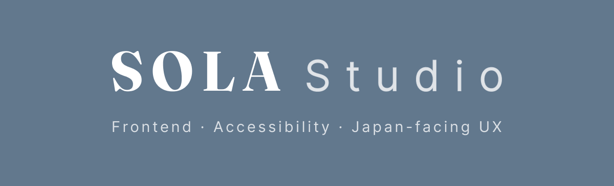
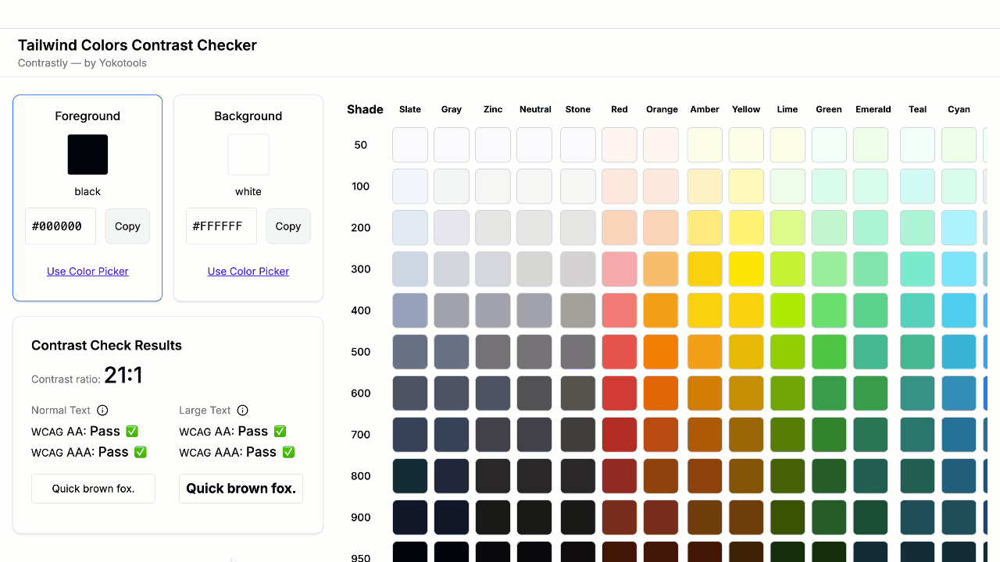

# Sola Studio

Sola Studio is an independent frontend-focused practice run by
[Yoko Shiina](https://github.com/yokoworks).

The studio supports teams with interface clarity and UX review, frontend implementation, accessibility review and remediation, and practical support where screen, flow, or implementation decisions need to become clearer.

---

## Tools and public work

### Contrastly — Open-source Tailwind Color Contrast Checker

A lightweight open-source color contrast checker for Tailwind CSS
palettes, custom hex values, and semantic color token decisions.

Built for frontend developers, designers, and anyone who needs to check
WCAG contrast quickly while working on UI color decisions.

**Stack:** Next.js / TypeScript / Tailwind CSS / Accessibility-aware UI

- [Open app](https://contrastly.solastudio.studio/)
- [Source code](https://github.com/sola-studio/contrastly)

---

## Services

### Interface Clarity

Structured review of screens, copy, and flows — mapping where users hesitate, stop, or misread. Available as UI/UX Review for broader scoped work, or as Conversion Friction Series for a single defined conversion flow.

### Frontend Partner

Ongoing frontend implementation support inside an existing team and codebase. Useful when frontend work needs to keep moving, but opening a full-time role is not the right next step.

### Accessibility Review & Remediation Support

Scoped accessibility review with prioritised findings and practical next steps. Remediation support available for agreed issues based on review findings.

---

## Technical focus

- React / Next.js / TypeScript
- Tailwind CSS / Radix UI
- Semantic HTML / ARIA / Keyboard and focus behavior
- Accessibility-aware frontend implementation
- API integration and data-flow collaboration
- UI implementation for product screens, internal tools, and dashboards
- Documentation and implementation notes for product-facing decisions

---

## Repository visibility

Most Sola Studio repositories are private client or studio work.
Public repositories are shared where there is a clear reason to
publish code, documentation, or open tools.

---

## Website

[https://solastudio.studio/international](https://solastudio.studio/international)
